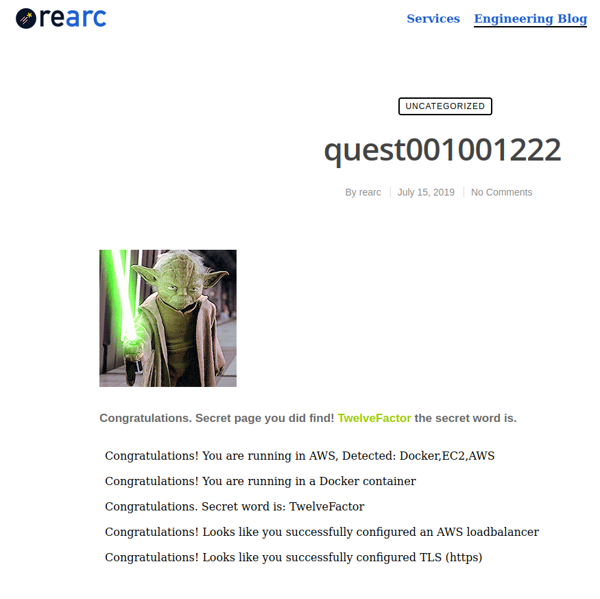
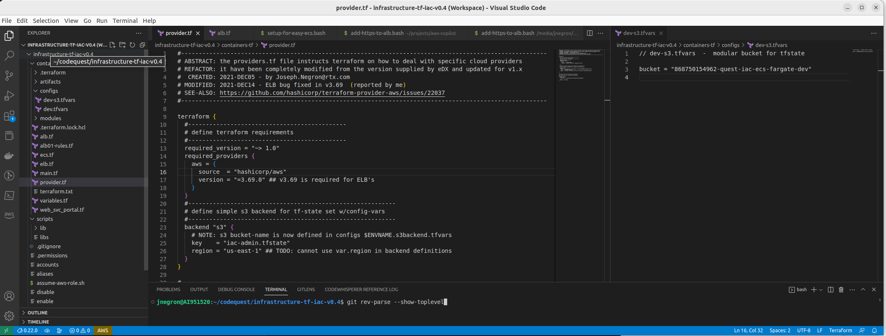

# Joe Negron's Rearc Quest Submission ___
PROJECT: Rearc Quest | Terraform+Docker POC on AWS

CREATED: 2023-FEB15 - by Joe.Negron.NYC@gmail.com

UPDATED: 2023-FEB17 - added README.md and other inline documentation

___


## Mission Overview

The Infrastructure as Code (IaC) described herein shall facilitate the deployment and teardown of the IaaS components necessary to host a "dockerized" version of the Rearc Quest application - through the implementation of AWS Cloud Services using the standard AWS-CLI and executed purely via Terraform. All files needed to replicate this solution into your AWS account, are contained within this single directory structure. The latest version of the application's source code is contained within a separate public git-repo. The initial deployment will: (1) build a load balanced infrastructure; (2) pull the latest code from the app-repo; (3) wrap that code in a dockerfile and expose the running app to the internet via HTTP; (4) wrap all HTTP traffic in TLS for standard HTTPS.  

## Solution Requirements
This solution has been tested with terraform v0.13.x and v1.1.x. Other than the code itself, this solution requires only the AWS-CLI, configured with the appropriate credentials (or IAM-Role), to deploy into the target AWS account using the Terraform executable.


## Acceptance Criteria
### Milestones 
You may do all or some of the following tasks. Please read over the complete list before starting.

1. If you know how to use git, start a git repository (local-only is acceptable) and commit all of your work to it.
1. Use Infrastructure as Code (IaC) to the deploy the code as specified below.
   - Terraform is ideal, but use whatever you know, e.g. CloudFormation, CDK, Deployment Manager, etc.
1. Deploy the app in a container in any public cloud using the services you think best solve this problem.
   - Use `node` as the base image. Version `node:10` or later should work.
1. Navigate to the index page to obtain the SECRET_WORD.
1. Inject an environment variable (`SECRET_WORD`) in the Docker container using the value on the index page.
1. Deploy a load balancer in front of the app.
1. Add TLS (https). You may use locally-generated certs.

### Definition of Done
Each stage can be tested as follows (where `<ip_or_host>` is the location where the app is deployed):

- [x] Public cloud & index page (contains the secret word) - `http(s)://<ip_or_host>[:port]/`
- [x] Docker check - `http(s)://<ip_or_host>[:port]/docker`
- [x] Secret Word check - `http(s)://<ip_or_host>[:port]/secret_word`
- [x] Load Balancer check  - `http(s)://<ip_or_host>[:port]/loadbalanced`
- [x] TLS check - `http(s)://<ip_or_host>[:port]/tls`


## Simple Design: "Web Servers Behind a Load Balancer"
This Terraform code adheres to best practices surrounding one of the simplest design patterns: *"Two+ WebServers Behind a Load Balancer"* is to attach an AWS ACM Certificate to an ALB to allow HTTPS traffic uses Terraform Modules for compartmentalized code maintenance.

## Architectural Elements
As defined in the `main.tf` file (contained within in the root of this Terraform code directory), a single `terraform apply` command will create the following AWS resources in US-East-1:

1. A custom VPC with 2 public subnets (for load balancers), 2 private subnets (for web servers), public route tables (to govern access controls)
1. Two Security Groups (EC2-SG) ALB-SG & Webserver-SG
1. A Single Layer-7 Load Balancer (ELBv2-L7) Multi-Zone ALB
1. A Single Autoscaling Group (EC2-ASG) with a min of 2 and max of 3 minimal webservers (EC2+A2Linux) each running Docker and a single NodeJS Base Image to host the custom application.

## Deployment Process 
Upon the launch of any new webserver node within the auto-scaling group as defined within `modules/compute/ec2-asg.tf` in 

## IaC Directory Structure
```
.
├── dockerizer.sh
├── main.tf
├── modules
│   ├── compute
│   │   ├── ec2-asg.tf
│   │   ├── outputs.tf
│   │   └── variables.tf
│   ├── dns
│   │   ├── outputs.tf
│   │   ├── route53.tf
│   │   └── variables.tf
│   └── network
│       ├── networking.tf
│       ├── outputs.tf
│       └── variables.tf
├── provider-aws.tf
├── README.md

```

The dockerfile is created during the 3rd-step of the initialization of any new server added to the ASG.

```
####################################################################################
# STEP-3: Wrap everything neatly in a simple dockerfile  
####################################################################################
cat > Dockerfile << EOF
# use node as container base-image
FROM node:16
# inject environment variables & copy the stuff we pulled from git to the container
ENV SECRET_WORD    TwelveFactor
COPY . .
# fetch and install node version manager & dependency packages
RUN curl -o- https://raw.githubusercontent.com/nvm-sh/nvm/v0.34.0/install.sh | bash \
    && . ~/.nvm/nvm.sh \
    && nvm install 16 \
    && npm install
# run express server
CMD ["npm", "start"]
EOF
```

### ROADMAP DAY-0 - CAVEAT EMPTOR: YOU ARE --> HERE!
## Prerequisites

1.  AWS CLI installed with appropriate IAM role access (e.g. EC2, ECR, ECS, logs, etc.). See this [AWS CLI documentation](https://docs.aws.amazon.com/cli/latest/userguide/cli-configure-files.html) details on how to set this up - if you need.

1.  AWS access key and secret key stored in their default location, or Terraform configured to know where to find valid credentials.  

1. Install and configure [Terraform](https://developer.hashicorp.com/terraform/tutorials/aws-get-started/install-cli) version 0.13 or better

1. That's it!

**Deployment example using git:**
```
git clone https://github.com/wwwizards/MY_PUBLIC_REPO_NAME.git
terraform init && terraform apply
```

NOTE: From my experience it takes somewhere between 5-7 minutes to deploy.

### ROADMAP DAY-1 - Production Readiness Efforts 

This solution (AS-REQUIRED & AS-DESIGNED) is my Quick & Dirty Proof of Concept (POC), and as such is not intended to be maintained by more than maybe just a few DevOps folks in a simple-environment (small-shop or sandbox) scenario. 
   - Although the solution itself is scalable, the maintenance of this code and the associated terraform state(s) may need to be refactored in order to utilize storage of said (state) files into S3, and possibly also implement record locking via DynamoDB. 
   - Many of us have learned (the hard way) that things can get kinda hairy when the right-hand doesn't know what the left-hand is doing -- so: before deploying this solution into production, it may become necessary to  
     - create a few extra vars and split out the configuration details into separate files for each environment, and 
     - maybe also have a better plan for maintaining the state files somewhere where they won't get clobbered by having too many cooks in the kitchen.  

I will be happy to provide examples (and even some plug-n-play sample code) like the one below upon request. 



### ROADMAP DAY-2 - Other Improvements 

1. - **Implement Continuous Integration** : using Jenkins or Codebuild some other CI pipeline that imports this GitHub repo's latest master branch when triggered by a commit using some kind of hook. 
      -  The additional ``jenkinsfile`` ``buildspec.yml`` and ``Dockerfile`` should direct the CI to create a Docker image from the latest build of the Rearc Quest application, and then push that resulting Docker image into an ECR repository for storage and deployment in Phase-two. 
   -  Additionally we can utilize DoD-Spec (pre-hardened) base-images by using [Iron Bank](https://p1.dso.mil/products/iron-bank). It's free (as in free beer) makes our jobs easier, keeps the CyberSecurity folks happy, and decreases the blast-radius of those CRITICAL & HIGH errors you will inevitably see in the ECR scan results - usually within a day or two. 
1. **Implement tagging module** to produce standard tags on all resources  
1. **Replace EC2 nodes & ASG with an ECS cluster** - by adding a few task & service definitions, we can utilize the basic HA auto scaling configurations that are built into ECS - to run the "dockerized" version of the Rearc Quest application using an AWS-Fargate serverless solution. 
   - This will provide better healthcheck capabilities than ASGs alone 
   - The new ECS cluster can be routed through the same VPC and Loadbalancer (already provisioned) and cutover with a BLUE/GREEN deployment method and zero-downtime. 
1. performance monitoring/alerting/automation with cloudwatch & triggers
1. log aggregation

#